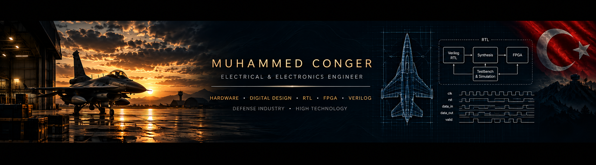

  

## About

Electrical & Electronics Engineer focused on **hardware and digital design**, with a long-term technical path toward **RTL design, verification, FPGA and SoC/ASIC development**.

My engineering background includes electronic hardware and PCB design, R&D, IoT systems, manufacturing, testing and commissioning.

Former Reserve Officer of the Turkish Air Force.

## Technical Focus

- Digital Design
- FPGA & Verilog HDL
- RTL Design & Verification
- Hardware & PCB Design
- SoC & ASIC Design

## Current Focus

Building and strengthening my digital design fundamentals through **RTL design, simulation, verification and FPGA projects**.

## Selected Work

### [Verilog HDL Educational Notes](https://github.com/muhammedconger/verilog)

A comprehensive educational study covering **Verilog HDL and digital design fundamentals**, developed during my earlier digital design studies.

---

**Defense Industry • High Technology • Hardware • Digital Design**

# Muhammed Conger

Electrical & Electronics Engineer focused on hardware and digital design.

## Technical Focus

- Digital Design
- FPGA & Verilog HDL
- RTL Design & Verification
- Hardware & PCB Design
- SoC & ASIC Design

## Current Focus

Building and strengthening my digital design fundamentals through RTL design, simulation, verification and FPGA projects.
